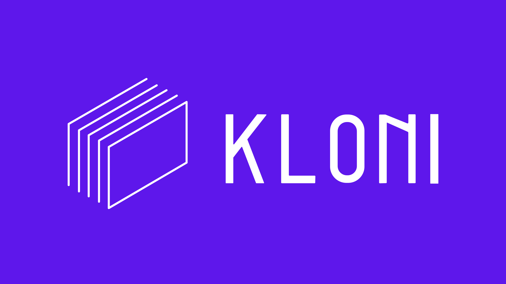

# Kloni 🚀
  

**Sync. Manage. Thrive.**  
Kloni is a sophisticated e-commerce inventory management system designed to synchronize product listings across multiple Mercado Libre accounts. Whether you’re cloning products, processing orders, or monitoring inventory, Kloni streamlines your multi-storefront operations with real-time precision and scalable power.


---

## ✨ Key Features

- **Product Cloning**  
  Clone products across Mercado Libre accounts, sync inventory quantities, and keep listings consistent—effortlessly.

- **Order Processing**  
  Real-time order webhooks from Mercado Libre, processed asynchronously via AWS SQS, with automatic inventory updates.

- **Multi-Account Mastery**  
  Manage multiple seller accounts with OAuth integration and cross-account synchronization.

- **Inventory Monitoring**  
  Track quantities across storefronts, prevent overselling, and automate updates in real time.

---

## 🛠 Tech Stack

### Backend
- **Go**: Clean, hexagonal architecture for performance and maintainability.
- **PostgreSQL**: Reliable storage for orders, accounts, and credentials.
- **Redis**: Fast caching for order data.
- **AWS SQS**: Asynchronous message queuing for order processing.
- **Docker: Docker**: Containerized for consistent deployments.

### Frontend
- **Next.js**: Dynamic dashboard and landing page with Edge Runtime optimizations.
- **Auth0**: Secure JWT-based authentication.
- **Tailwind CSS**: Sleek, utility-first styling.

### DevOps
- **Terraform**: Infrastructure as Code for cloud setups.
- **GitHub Actions**: Automated CI/CD workflows.
- **Docker Compose**: Simplified local development.

---

## 🌟 How It Works

### System Architecture
Kloni follows a **clean architecture** with distinct layers:
- **Entities**: Core models (`announcement.go`, `order.go`).
- **Use Cases**: Business logic in `usecases/`.
- **Adapters**: External integrations (`api/`, `cache/`, `mercadolivre/`, `queue/`, `repository/`).

### Key Workflows
1. **Order Processing**  
   - Webhook → SQS queue → Worker updates clones’ quantities → Database/cache sync.
2. **Product Cloning**  
   - Select product → Set titles → Fetch details → Clone across accounts → Sync data.

---

## 🚀 Quick Start

Get Kloni running locally in no time!

### Prerequisites
- [Docker](https://www.docker.com/get-started) & [Docker Compose](https://docs.docker.com/compose/)
- [Node.js](https://nodejs.org/) (v16+)
- Accounts: Mercado Libre API, Auth0, AWS, PostgreSQL, Redis

### Installation

1. **Clone the Repo**
   ```bash
   git clone https://github.com/Vractos/kloni.git
   cd kloni
   ```

2. **Set Environment Variables**
   - Copy `.env.example` to `.env` and fill in your credentials (e.g., Mercado Libre API keys, Auth0, AWS).

3. **Launch with Docker Compose**
   ```bash
   docker-compose up --build
   ```

4. **Access Kloni**
   - Backend API: `http://localhost:8080`
   - Frontend Dashboard: `http://localhost:3000`

---

## 🔧 Development Highlights

- **Error Handling**: Robust, with specific error types and Zap logging.
- **Testing**: Extensive unit tests for order processing logic.
- **Webhooks**: Real-time updates via Mercado Libre integration.
- **Database**: Relational SQL schema for stores, credentials, and orders.

---

## 🤝 Contributing

We welcome contributions!  
- Fork the repo.
- Branch out (`git checkout -b feature/awesome-addition`).
- Commit (`git commit -m "Add awesome addition"`).
- Push (`git push origin feature/awesome-addition`).
- Open a Pull Request!

See [CONTRIBUTING.md](CONTRIBUTING.md) for details (coming soon!).

---

## 📜 License

Kloni is proudly open-source under the [MIT License](LICENSE). Build, tweak, and share freely!

---

## 💡 Why Kloni?

Kloni is built for sellers who juggle multiple Mercado Libre accounts and need seamless inventory control. With real-time sync, multi-account support, and a scalable architecture, it’s your key to mastering the marketplace—whether you’re a solo hustler or a growing enterprise.

---

**Crafted by [Vractos](https://github.com/Vractos) with ❤️**  
Love it? Star the repo! ⭐ Got feedback? [Open an issue](https://github.com/Vractos/kloni/issues).